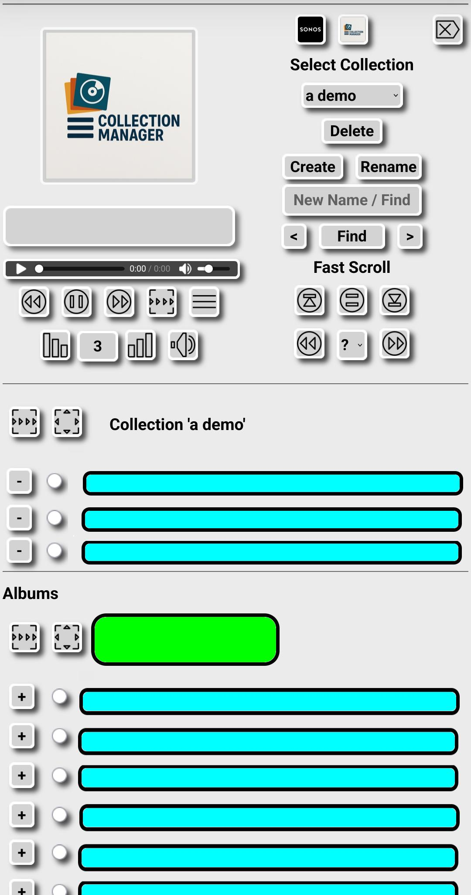

[](http://unlicense.org/)

## License

This project is licensed under the terms of the Unlicense.
<br>For more details, please refer to [UNLICENSE.md](UNLICENSE.md).
<br>For more information, please refer to <http://unlicense.org>.

# Audio Collection Manager, Player and Sonos Scan

With this web based tool you can:

  - build audio collections from your albums
    - an album is a (sub-)folder with audio files
    - a collection is like a playlist but has own files in a seperate folder
  - play your audio files, collections and albums
  - play these anywhere you want, PC, tablet, phone and via bluetooth on your car speakers
  - when you have Sonos:
    - start indexing your library so it finds your new collections as albums
    - Sonos will sort them in a way you see them before all existing albums

<br>The screenshot below shows the interface.<br>



  - on the left you see a player with artwork, title marquee, progress and buttons
  - in the top row are buttons to start indexing on Sonos, show backlight and logout of the application
  - below that you can select an already created collection
  - to delete the selected collection click the 'Delete' button
  - to create or rename a collection you type the new name in the 'New Name/Find' box and click a button
  - you can find audio files by typing a part in the 'New Name/Find' box and clicking the Find buttons
  - the Fast Scroll buttons jump to top/middle/end of your albums list
  - the lower buttons navigate to a previous/next album or jump to a section you select from the menu with the question mark
  - you can scroll the part below the player up and down so you can see your selected collection and all your albums
    - after installation there is no collection so you only see your albums
  - the Green box is where you will see an album folder name and each blue box is a place where you will see an audio file name
  - audio files can be added to the collection with a ' + ' button
  - they can be removed from a collection with a ' - ' button
  - use radio buttons to play individual files
  - use other buttons to play the collection or an album sorted or shuffled

## Audio folder tree and collections

To explain about collections I assume you have a folder structure like '/Data/Music' with subfolder trees with at the deepest level folders with the audio files for the albums you have.
<br>Something like:

```
/Data/Music
            +- Album name 1
            +- Album name 2
            +- Album name 3
            +- Albums group 1 ( no audio files in this folder )
                    +- Album name 4
                    +- Album name 5
            +- Album name 6
            +- Album name 7
            +- Album name 8
            +- Collections group ( no audio files in this folder )
                    +- Collection name 1
                    +- Collection name 2
                    +- Collection name 3
                    +- Etcetera
            +- Album name 9
            +- Etcetera
```

  - '/Data/Music' is your top folder
    - you can give this folder a different name
  - a dedicated folder 'Collections group' for the collection folders will be created in this top folder for you
    - you can give this folder a different name
  - when you create a collection named 'a demo' a folder with that name is created in the dedicated collections folder
  - when you use the tool to add an audio file to a collection like 'a demo':
    - the file is copied to the folder 'a demo' of the collection
        - the original files stays untouched
    - when the copy is not an mp3 it is converted to an mp3
    - when at this stage the mp3 misses artwork of picture_type 3 (CD cover) it is inserted here
    - when artwork is missing in the mp3, the album folder is checked for Folder.jpg, folder.jpg, AlbumArtSmall.jpg or albumartsmall.jpg
    - when that is missing a default picture is inserted
    - the mp3 tag album is set to the collection name like '(a demo)' More about this tag below...
    - the mp3 tag artist is set to 'Collection' More about this tag below...
    - the mp3 tag album_artist is cleared  More about this tag below...
    - the mp3 tag title is set to 'title (artist name)' More about this tag below...
  - when you use the tool to remove an audio file from a collection
    - the file is deleted from the collection folder
  - when you delete a collection
    - the collection folder with all files in it is deleted
  - when you rename a collection
    - the collection folder is renamed
    - the mp3 tag album in each file in the collection is updated to the new name
    - when you have Sonos you may want to click the Sonos button
     
More about the mp3 tags...
<br>They need to get these values because of the way Sonos 'detects' albums since the Sonos APP change in may 2024.
<br>Sonos shows an album for each unique combination of album, artist and album_artist so I have situations where 1 actual album is seen as more than 5 albums by Sonos.
<br>In Sonos and in the player of this tool we still want to show the artist name and this is why I add the artist to the title tag.
<br>The parentheses around the collection name in the album tag ensure that the collection is shown at the top of the albums in the library overview in Sonos.

# Installation

These instructions are to install on a  Raspberry Pi with an OS like bookworm.

## Very basic description of the installation of a Raspberry Pi with an OS

When you want to install on a new Raspberry Pi you may want to search the web for 'Raspberry Pi Imager' and use what you find to get a basic Raspberry Pi up and running.
<br>I use a 64 GB card and in the Imager I select the 64 bit version which has as many options as possible.
<br>So I select: -- Raspberry Pi OS (other) -- Raspberry Pi OS Full (64-bit).
<br>In the customisation settings I configure hostname, username pi and password and locale settings and skip the wireless LAN.
<br>On the Services tab I enable ssh access with password authentication.

After booting the installation and waiting some time you can use 'ssh pi@ip_address_of_your_Raspberry_Pi' to login and you may want to use 'sudo apt update' and 'sudo apt upgrade', change some settings with 'sudo raspi-config' like enable vnc, set root password etc.

I prefer to connect by vnc and start a terminal window. After that I use 'sudo geany /etc/ssh/sshd_config' to enter 'PermitRootLogin yes' and 'UsePAM no'. I use 'sudo systemctl restart ssh' to activate this.

<i>This enables ssh for root and access to the Raspberry filesystem with SFTP GUI tools like FileZilla which gives you the possibility to transfer and edit files.</i>

A fixed IP address is also welcome and you can fix it with 'sudo nmtui-edit'. You may also make a reservation in the DHCP server of your router or pihole.

## Install the apache webserver 

When you finished your basic things install the web server apache2.

Start a terminal with 'ssh pi@ip_address_of_your_Raspberry_Pi' and 'sudo apt install apache2 -y'

After this you should be able to use a web browser and browse to ```http://ip_address_of_your_Raspberry_Pi/``` and see a web page.

## Install PHP ( version 8.3 )

(I followed <a href="https://php.watch/articles/php-8.3-install-upgrade-on-debian-ubuntu">https://php.watch/articles/php-8.3-install-upgrade-on-debian-ubuntu)</a>

Start a terminal with 'ssh pi@ip_address_of_your_Raspberry_Pi' and:

 - sudo apt install apt-transport-https
 - sudo curl -sSLo /usr/share/keyrings/deb.sury.org-php.gpg https://packages.sury.org/php/apt.gpg
 - sudo sh -c 'echo "deb [signed-by=/usr/share/keyrings/deb.sury.org-php.gpg] https://packages.sury.org/php/ $(lsb_release -sc) main" > /etc/apt/sources.list.d/php.list'
 - sudo apt update
 - sudo apt install php8.3 php8.3-cli php8.3-{bz2,curl,mbstring,intl}
 - sudo apt install libapache2-mod-php8.3

Create a test file:
  - sudo -i
  - ```echo echo '<?php phpinfo(); ?>' > /var/www/html/info.php```

Now you should be able to browse to  ```http://ip_address_of_your_Raspberry_Pi/info.php``` and see a page with info.

## Install this tool

The installation is in some steps.

Start a terminal with 'ssh pi@ip_address_of_your_Raspberry_Pi' 

#### Get Collection_Manager.php up and running

We need to copy the application from the internet to the web server and make some little changes depending on your needs.

  - sudo -i
  - cd /var/www/html
  - git clone https://github.com/JackV2020/Collection_Manager.git
  - ps -ef | grep apache2
    - apache will need to be able to create the collection so...
    - note the executing userName which could be www-data and...
  - chown www-data: Collection_Manager -R
    - replace www-data with the userName you found before

    Here you may use FileZilla or another tool to edit files.
    Maybe you use vnc to access you Raspberry Pi and use the geany editor, what you prefer.
    Just:
    
  - edit the file Authentication_Init.php
    - the file explains which values to change
  - edit the file Collection_Manager_Init.php
    - the file explains which values to change
  - mkdir -p /Data/Music/Collections_Manager
    - use your path which may not be /Data/Music/Collections_Manager
  - chown www-data: /Data/Music/Collections_Manager
    - use your path and replace www-data with the userName you found

Now you should be able to browse to ```http://ip_address_of_your_Raspberry_Pi/Collection_Manager/Collection_Manager.php``` and logon with user accounts you created in Authentication_Init.php.
<br>When you do this on a computer browser zoom out to 50% and see all album folders which you have in /Data/Music.
<br>When you have no album folders in /Data/Music you should place them there.
<br>When you have album folders but do not see them you should give www-data read access some way. Maybe 'chmod o+r /Data/Music -R'
<br>When you logon with an administrator account you should also be able to create your first empty collection.
<br><i>You can not add titles to the collection yet.</i>
<br>When you see an Error you need to correct access rights to the folders.
<br>This may involve read rights to '/Data/Music/' and (sub)folders and files.

#### Enable mp3 handling

Collection_Manager.php uses Collection_Manager.py to handle mp3 files with eyed3.

To install:
  - sudo apt install eyed3

Find the path to the module:
  - find /usr/lib -name eyed3

This should give:
  - /usr/lib/python3/dist-packages/eyed3

When it is not '/usr/lib/python3/dist-packages/eyed3' put the directory path you found in Collection_Manager.py in the line after 'import sys' which is sys.path.append('/usr/lib/python3/dist-packages') Note you only need the directory '/usr/lib/python3/dist-packages'

Now you should be able to use all functions to maintain collections.

(Note that this also gives a command line tool with a capital D in it. To see the most important mp3 tags use: eyeD3 mp3-file)

#### Enable Sonos Scan

You can skip this when you do not have Sonos.

<i>Below you may get messages like:</i>

locale: Cannot set LC_CTYPE to default locale: No such file or directory
<br>locale: Cannot set LC_MESSAGES to default locale: No such file or directory
<br>locale: Cannot set LC_ALL to default locale: No such file or directory

<i>Do not worry, there is a locale fix for that which is further below.</i>

Collection_Manager.php uses Collection_Manager.py to start the Sonos Scan with the soco module.

This module can not be installed just like that.

It needs a virtual python environment so:

  - sudo -i
  - cd /var/www/html/Collection_Manager
  - python3 -m venv venv    (this command contains venv 2 times and really takes a while, ...wait...)
  - source venv/bin/activate
  - pip install soco
  - deactivate

After that you can test:

  - ./venv/bin/python3 Collection_Manager.py start_sonos_scan

The response should be "OK Updating on " and list your Sonos devices.

Note that in the web tool only the members of $adminusers_2 in Authentication.php can start the Sonos Scan.

#### locale fix

To solve the issue with the locale messages fix it:

  - enter the command 'locale' and see the messages
  - sudo dpkg-reconfigure locales
  - check the locales you want (select with space bar)
  - I select en_US.UTF-8 UTF-8 and nl_NL.UTF-8 UTF-8
  - Press Enter
  - select the default, I selected en_US.UTF-8
  - log out and on
  - enter the command 'locale' and the messages should be gone

## That's all(most all)....

That's all to get it up and running on your home network.

When you want to have remote access you may use port forwarding on your ISP router to your web server.
This is not safe unless you use https with a certificate from for example <a href="https://letsencrypt.org/">https://letsencrypt.org/</a>

Another option which I use is a vpn by pivpn on my Raspberry Pi which encrypts all the traffic so even http traffic is safe.

And that's all.
<hr>

